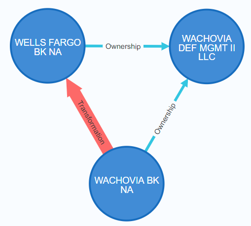
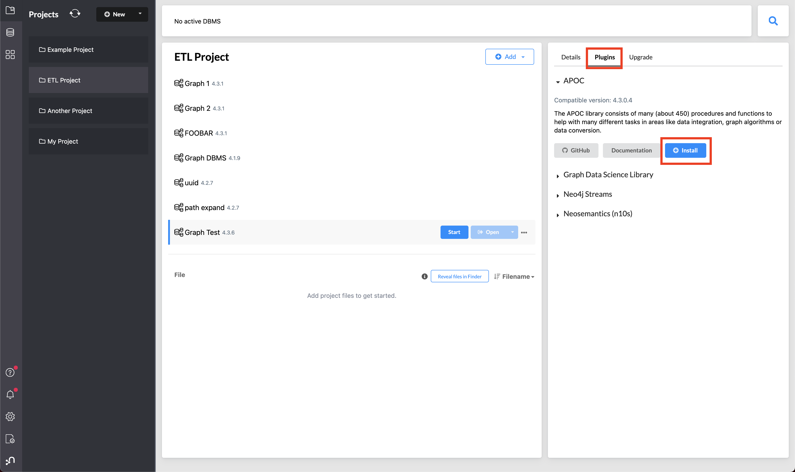

# NIC Pattern Datasets
Created: December 5, 2022 4:11 PM

## Table of Contents

- [NIC Pattern Datasets](#nic-pattern-datasets)
  * [NIC Dataset Overview](#nic-dataset-overview)
  * [Graph Representation](#graph-representation)
  * [Online Access to the Dataset](#online-access-to-the-dataset)
- [Ground Truth Datasets](#ground-truth-datasets)
  * [Patterns](#patterns)
  * [File Structure](#file-structure)
- [Building From Source (NIC) Data](#building-from-source-nic-data)
    + [Installing APOC](#installing-apoc)
  * [Cypher Queries](#cypher-queries)

<small><i><a href='http://ecotrust-canada.github.io/markdown-toc/'>Generated with markdown-toc</a></i></small>


## NIC Dataset Overview

The data for this repository comes from the Federal Financial Institutions Examination Council’s (FFIEC) National Information Center (NIC). The NIC provides historical information on banks and other institutions (FIs) for which the Federal Reserve supervisory, regulatory, or research interest. 

The NIC dataset includes three tables: RELATIONSHIPS, TRANSFORMATIONS, and ATTRIBUTES. 

### **ATTRIBUTES Table**

Detailed descriptions of each FI are specified in the ATTRIBUTES tables. There are three different ATTRIBUTES tables, and FIs are recorded in the table according to their current registration status; active FIs are found in the ACTIVE table, closed FIs are found in the CLOSED table, and branches are found in the BRANCHES table. There are 384,591 FIs recorded across these three ATTRIBUTES tables as of November 2022. Each FI’s is assigned a unique identifier: the Research, Statistics, Supervision and Regulation, and Discount and Credit Database (RSSD) ID.  The RSSD ID is the primary key by which the RELATIONSHIPS and TRANSFORMATIONS reference an FI. 

Features of the ATTRIBUTES table include the FI’s legal name, date and jurisdiction of incorporation/closure, headquarters addresses, registration identifiers, as well as codes for the FIs registered roles (e.g., to distinguish savings banks from credit unions). Features of the 

### **RELATIONSHIPS Table**

The RELATIONSHIPS table captures the 273,036 control relationships that exist(ed) between FIs from the year 1806 to the present day. RELATIONSHIPS table include the date on which the relationship was established and/or terminated, as well as the percentage equity owned by the controlling FI. Features of the 

### TRANSFORMATIONS Table

The NIC dataset also includes 57,320 transformations which describe four types of special events between FIs: mergers, splits, sale of assets, and failure. TRANSFORMATIONS table include the date on which the transformation occurred, the type of transformation and the method of accounting (i.e., either through pooling of interests/entities at book value or through purchase/acquisition at market value).

## Graph Representation

The dataset can be modeled as a directed, heterogeneous, dynamic graph. The graph is directed because control and transformation are directional relationships. It is heterogeneous because financial entities are categorized by the NIC into three classes: Active, Branch, and Closed. And the graph is dynamic because the FIs and the relationships between FIs change over time as FIs open, close, purchase, merge, fail, and/or split.

## Online Access to the Dataset

Data download: [https://www.ffiec.gov/npw/FinancialReport/DataDownload](https://www.ffiec.gov/npw/FinancialReport/DataDownload)

Data dictionary: [https://www.ffiec.gov/npw/StaticData/DataDownload/NPW Data Dictionary.pdf](https://www.ffiec.gov/npw/StaticData/DataDownload/NPW%20Data%20Dictionary.pdf)

The data was loaded into Neo4j using my Java toolset (available on [Github](https://github.com/austinleedavis/neo4j-financial-data-importer)).

# Ground Truth Datasets

## Patterns

The ground truth datasets are based on observed patterns in the data. These patterns were then articulated to Neo4j using cypher queries. The results were exported to CSV files, one CSV file for each pattern. 

Each pattern matches to multiple instances. For example, there are 19 instances of the Wach-WF DEF MGMT pattern, and those 19 instances are a subset of the 6,205 instances ALL DEFEASANCE MANAGEMENT pattern. Each involves one or more RSSD_IDs (companies). For example, an instance of the instant subsidiaries pattern involves exactly two companies: the subsidiary that was just opened and the parent company that instantly gained control over it.

The table below lists several patterns from the NIC dataset. This is by no means an exhaustive list of patterns, but the datasets 

| Pattern Name | Description | Instance Count | RSSD_ID Count | Runtime (ms) |
| --- | --- | --- | --- | --- |
| Wach-WF DEF MGMT | The original 19 defeasance managements companies under the Wachovia-Wells Fargo merger, plus Wachovia and Wells Fargo | 19 | 57 | 1350 |
| WACH-WF DEF MGMT SUBSIDS | All the subsidiaries of the original Defeasance Managements companies under the Wachovia-Wells Fargo merger, the DEF MGMT companies, plus Wachovia and Wells Fargo | 19 | 488 | 1208 |
| ALL DEFEASANCE MANAGEMENT SUBSIDS | Subsidiaries of the defeasance management companies, plus the DEF MGMT companies, plus the predecessor and successor of the DEF MGMT company. The DEF MGMT pattern is such that a company D is owned in-turn by the predecessor then the successor, where the date of hand-off occurs on a single day. | 6,205 | 359,178 | 3922 |
| ALL DEFEASANCE MANAGEMENT | Companies matching the Defeasance management pattern, their predecessor and their successor. The DEF MGMT pattern is such that a company D is owned in-turn by the predecessor then the successor, where the date of hand-off occurs on a single day. | 6,205 | 18,615 | 2237 |
| Instant subsidiaries | Companies where the date on which they Open is within 1-day of the date on which ownership by a parent company is established | 114,445 | 228,890 | 1477 |
| Instant owners | Companies where the date on which they open is within 1-day of the date on which they take control over other companies | 55,578 | 111,156 | 843 |
| Handoffs | Companies where ownership by its previous parent company is succeeded by a new parent company, and that change of hands occurs on a single day. Subgroup includes the child, and both parent companies | 744,513 | 744,513 | 2504 |
| Bloom | Parent companies where their subsidiaries with zero subsidiaries outnumber their subsidiaries with non-zero subsidiaries. (Parent companies with <5 subsidiaries were ignored.) Graphically, these look like dandelions | 6042 | 6042 | 297 |

## File Structure

The ground truth datasets are available for download from: 

[https://github.com/austinleedavis/NIC_Pattern_Datasets](https://github.com/austinleedavis/NIC_Pattern_Datasets)

Each file has the following structure:

| SubgroupID | ID_RSSD |
| --- | --- |
| 0 | 484422 |
| 0 | 3370441 |
| 0 | 451965 |
| 1 | 484422 |
| 1 | 3721931 |
| 1 | 451965 |
| ⋮ | ⋮ |

The `SubgroupID` column represent the instance of the pattern to which each of the ID_RSSDs belong. When multiple ID_RSSDs are listed, the instance includes multiple NIC entries in the single instance. 

In the example above from the head of the `Pattern_Wach_WF_DEF_MGMT.csv` file, there are the ID_RSSDs listed for subgroup (instance) 0: 484422, 3370441, and 451965; and three more ID_RSSDs are listed for subgroup 1: 484422, 3721931, and 451965. 

<aside>
💡 Notice ID_RSSD 484422 and 451965 are members of all instances in the `Pattern_Wach_WF_DEF_MGMT.csv`. This is because 451965 is the RSSD for **Wells Fargo BK NA**, and 484422 is the RSSD for **Wachovia BK NA**, and the pattern used to generate this dataset is defined to include these two banks. 
This kind of repetition can be present in other patterns but does not generally occur.

</aside>

### Reconstructing the graph for a single instance

Since multiple ID_RSSDs are listed in most patterns, the `unwind` operator can be used to reconstruct the original graph. In the case of `SubgroupID:0` from above, we can reconstruct the graph as follows:

1. Join each `ID_RSSD` listed for `SubgroupID` 0 into a list:
`[484422, 3370441, 451965]`
2. Use this list in one of the following queries:
    
    ```sql
    // reconstruct just the nodes
    UNWIND [484422, 3370441, 451965] as rssd 
    MATCH (n {ID_RSSD:rssd}) RETURN *
    ```
    
    ```sql
    // reconstruct the nodes and relationships separately
    WITH [484422, 3370441, 451965] as rssds
    MATCH (m)-[t]-(o) WHERE m.ID_RSSD in rssds and o.ID_RSSD in rssds
    RETURN *
    ```
    
    ```sql
    // reconstruct the paths
    WITH [484422, 3370441, 451965] as rssds
    MATCH p=((m)-[t]-(o)) WHERE m.ID_RSSD in rssds and o.ID_RSSD in rssds
    RETURN p,relationships(p),nodes(p)
    ```
    
3. Running the first query above produces the following graph (Note: Although edges are visible because the “**Settings > Connect result nodes”** option is enabled, they are not actually returned by the query):



# Building From Source (NIC) Data

The pattern datasets can be built from the raw NIC data using cypher queries and the Awesome Procedures on Cypher (APOC) plugin.

### Installing APOC

Instructions for installing APOC can be found at: [Installation - APOC Extended Documentation (neo4j.com)](https://neo4j.com/labs/apoc/4.4/installation/). From Neo4j desktop, simply select the DBMS you’ll be using, open the Plugins tab on the right, expand the APOC drop-down, and click `Install`, as in:



## Cypher Queries

The following cypher queries can be executed to reproduce the datasets listed above. Executing these queries requires the APOC plugin to be installed in Neo4j.

### Pattern_Wach_WF_DEF_MGMT.csv

```sql
WITH "MATCH (pred {NM_SHORT:'WACHOVIA BK NA'})-[r:Ownership]->(def)<-[t:Ownership]-(succ {NM_SHORT:'WELLS FARGO BK NA'}) WHERE duration.inDays(r.D_DT_END, t.D_DT_RELN_EST).days<=1.0 AND NOT pred=succ Match (pred)-[a:Ownership]->(othr)<-[b:Ownership]-(succ)-[c:Ownership]->(def)-[d:Ownership]->(othr) WHERE NOT othr=def AND NOT pred=othr AND NOT succ=othr
	with DISTINCT pred,def,succ
	with collect([pred,def,succ]) as col
	unwind range(0,size(col)-1) as un
	unwind col[un] as n
	RETURN un as SubgroupID, n.ID_RSSD as ID_RSSD" AS query
CALL apoc.export.csv.query(query,"Pattern_Wach_WF_DEF_MGMT.csv",{})
YIELD file, source, format, nodes, relationships, properties, time, rows, batchSize, batches, done, data
RETURN file, source, format, nodes, relationships, properties, time, rows, batchSize, batches, done, data
```

### Pattern_WACH_WF_DEF_MGMT_SUBSIDS.csv

```sql
WITH "MATCH (pred {NM_SHORT:'WACHOVIA BK NA'})-[r:Ownership]->(def)<-[t:Ownership]-(succ {NM_SHORT:'WELLS FARGO BK NA'}) WHERE duration.inDays(r.D_DT_END, t.D_DT_RELN_EST).days<=1.0 AND NOT pred=succ Match (pred)-[a:Ownership]->(othr)<-[b:Ownership]-(succ)-[c:Ownership]->(def)-[d:Ownership]->(othr) WHERE NOT othr=def AND NOT pred=othr AND NOT succ=othr
	with DISTINCT pred,def,succ, collect(othr) as othrs
	with [pred,def,succ]+othrs as subgrp
	with collect(subgrp) as col
	unwind range(0,size(col)-1) as un
	unwind col[un] as g
	unwind g as n
	RETURN un as SubgroupID, n.ID_RSSD as ID_RSSD" AS query
CALL apoc.export.csv.query(query,"Pattern_WACH_WF_DEF_MGMT_SUBSIDS.csv",{})
YIELD file, source, format, nodes, relationships, properties, time, rows, batchSize, batches, done, data
RETURN file, source, format, nodes, relationships, properties, time, rows, batchSize, batches, done, data
```

### Pattern_ALL_DEFEASANCE_MANAGEMENT_SUBSIDS.csv

```sql
WITH "MATCH (pred)-[r:Ownership]->(def)<-[t:Ownership]-(succ) WHERE duration.inDays(r.D_DT_END, t.D_DT_RELN_EST).days<=1.0 AND NOT pred=succ MATCH (pred)-[a:Ownership]->(othr)<-[b:Ownership]-(succ)-[c:Ownership]->(def)-[d:Ownership]->(othr)
	WHERE NOT othr=def AND NOT pred=othr AND NOT succ=othr AND duration.inDays(a.D_DT_END, b.D_DT_RELN_EST).days<=1.0 AND duration.inDays(b.D_DT_RELN_EST,d.D_DT_END).days >0
	with DISTINCT pred,def,succ, collect(othr) as othrs
	with [pred,def,succ]+othrs as subgrp
	with collect(subgrp) as col
	unwind range(0,size(col)-1) as un
	unwind col[un] as g
	unwind g as n
	RETURN un as SubgroupID, n.ID_RSSD as ID_RSSD" AS query
CALL apoc.export.csv.query(query,"Pattern_ALL_DEFEASANCE_MANAGEMENT_SUBSIDS.csv",{})
YIELD file, source, format, nodes, relationships, properties, time, rows, batchSize, batches, done, data
RETURN file, source, format, nodes, relationships, properties, time, rows, batchSize, batches, done, data
```

### Pattern_ALL_DEFEASANCE_MANAGEMENT.csv

```sql
WITH "MATCH (pred)-[r:Ownership]->(def)<-[t:Ownership]-(succ) WHERE duration.inDays(r.D_DT_END, t.D_DT_RELN_EST).days<=1.0 AND NOT pred=succ 
	MATCH (pred)-[a:Ownership]->(othr)<-[b:Ownership]-(succ)-[c:Ownership]->(def)-[d:Ownership]->(othr)
	WHERE NOT othr=def AND NOT pred=othr AND NOT succ=othr AND duration.inDays(a.D_DT_END, b.D_DT_RELN_EST).days<=1.0 AND duration.inDays(b.D_DT_RELN_EST,d.D_DT_END).days >0
	with DISTINCT pred,def,succ
	with collect([pred,def,succ]) as col
	unwind range(0,size(col)-1) as un
	unwind col[un] as n
	RETURN un as SubgroupID, n.ID_RSSD as ID_RSSD" AS query
CALL apoc.export.csv.query(query,"Pattern_ALL_DEFEASANCE_MANAGEMENT.csv",{})
YIELD file, source, format, nodes, relationships, properties, time, rows, batchSize, batches, done, data
RETURN file, source, format, nodes, relationships, properties, time, rows, batchSize, batches, done, data
```

### Pattern_instant_subsidiaries.csv

```sql
WITH "Match (n)<-[t:Ownership]-(m) WHERE duration.inDays(n.D_DT_OPEN,t.D_DT_RELN_EST).days<1.0 
	with DISTINCT  n,m
	with collect([n,m]) as col
	unwind range(0,size(col)-1) as un
	unwind col[un] as n
	RETURN un as SubgroupID, n.ID_RSSD as ID_RSSD" AS query
CALL apoc.export.csv.query(query,"Pattern_instant_subsidiaries.csv",{})
YIELD file, source, format, nodes, relationships, properties, time, rows, batchSize, batches, done, data
RETURN file, source, format, nodes, relationships, properties, time, rows, batchSize, batches, done, data
```

### Pattern_instant_owners.csv

```sql
WITH "Match (n)-[t:Ownership]->(m) WHERE duration.inDays(n.D_DT_OPEN,t.D_DT_RELN_EST).days<1.0 
	with DISTINCT  n,m
	with collect([n,m]) as col
	unwind range(0,size(col)-1) as un
	unwind col[un] as n
	RETURN un as SubgroupID, n.ID_RSSD as ID_RSSD" AS query
CALL apoc.export.csv.query(query,"Pattern_instant_owners.csv",{})
YIELD file, source, format, nodes, relationships, properties, time, rows, batchSize, batches, done, data
RETURN file, source, format, nodes, relationships, properties, time, rows, batchSize, batches, done, data
```

### Pattern_handoffs.csv

```sql
WITH "MATCH (pred)-[r:Ownership]->(subsid)<-[t:Ownership]-(succ) WHERE duration.inDays(r.D_DT_END, t.D_DT_RELN_EST).days<=1.0 
	WITH DISTINCT  pred,subsid,succ
	WITH collect([pred,subsid,succ]) as col
	UNWIND range(0,size(col)-1) as un
	UNWIND col[un] as n
	RETURN un as SubgroupID, n.ID_RSSD as ID_RSSD" AS query
CALL apoc.export.csv.query(query,"Pattern_handoffs.csv",{})
YIELD file, source, format, nodes, relationships, properties, time, rows, batchSize, batches, done, data
RETURN file, source, format, nodes, relationships, properties, time, rows, batchSize, batches, done, data
```

### Pattern_bloom.csv

```sql
WITH "MATCH (head)-[t:Ownership]->(petal) 
    WITH head,t, size((petal)-[:Ownership]->()) as Kp
    WHERE Kp=0
    WITH head, count(t) as Kp
    WHERE Kp>5
    WITH DISTINCT head
    WITH collect([head]) as col
    unwind range(0,size(col)-1) as un
    unwind col[un] as n
    return un as SubgroupID, n.ID_RSSD as ID_RSSD" AS query
CALL apoc.export.csv.query(query,"Pattern_bloom.csv",{})
YIELD file, source, format, nodes, relationships, properties, time, rows, batchSize, batches, done, data
RETURN file, source, format, nodes, relationships, properties, time, rows, batchSize, batches, done, data
```
